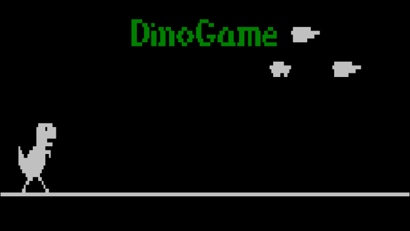

# dinoSpiel
C-Projekt - Nachprogrammierung des Google Chrome Dino Spiels  
Zu bewertendes Projekt zum Ende des ersten Schuljahres von Benjamin und Philip für das Fach C-Programmierung am BSZ-WiDat in Würzburg.

Eine Nachprogrammierung des [Spieles, dass Google Chrome anzeigt wenn man keine Verbindung hat.](http://apps.thecodepost.org/trex/trex.html)  
Realisiert unter Linux auf der Konsole mithilfe der ncurses-Bibliothek.

Leider funktioniert das Spiel nicht richtig.  
Irgendwo (vermutlich in der Ausgabe) existieren Fehler, die wir nicht finden konnten und die sich auf verschiedenen Systemen unterschiedlich auswirken. Bei manchen gibt es sofort Speicherzugriffsfehler, bei manchen ist die Anzeige stark verbugt, die Kakteen nicht zu sehen und das Spiel ist leider unspielbar.  
Alles darum herum funktioniert, Menüführung,  Highscores einlesen, eintragen, und speichern, Texturen einlesen. Auch das Springen des Dinos und die Kollision mit Kakteen funktionieren, werden nur nicht richtig angezeigt.

Es ist natürlich enttäuschend, dass, obwohl wir so viel Arbeit reingesteckt haben, das Wichtigste nicht richtig funktioniert.  
Aber wir haben auf jeden Fall sehr viel Wertvolles gelernt, unter Anderem den Umgang mit einer Bibliothek, die Grundlagen der Spieleentwicklung, Arbeiten mit Git und Arbeiten im Team.

## Installation
- Klonen Sie das Repository oder laden Sie den Ordner Dinospiel herunter.
- Installieren Sie die ncurses Bibliothek über ihren Packagemanager, auf Ubunutu: `apt-get install libncurses5-dev`
- Im Ordner Dinospiel kompilieren Sie Dinospiel.c und linken dabei ncurses: `gcc Dinospiel.c -lncurses`
- Führen Sie die erstellte Datei aus: `./a.out`

## Benutzerhandbuch
Zu Beginn wird Ihnen das Hauptmenü gezeigt. Von hier aus können Sie das Spiel starten, die gespeicherten Highscores ansehen, die Hilfe aufrufen oder das Spiel beenden.

### Steuerung
#### In Menüs:
- Pfeiltasten hoch und runter zum Ändern der Auswahl
- Enter zum Auswählen des markierten Menüpunktes

#### Im Spiel:
- Pfeiltaste oben oder Leertaste zum Springen
- ESC zum Pausieren

### Spielablauf
Ein Meteorit wird bald in Dinoland einschlagen. Die Dinos müssen fliehen, aber der einzige Weg führt durch die __lange und gefährliche Kakteenwüste__.  
Helfen Sie dem Dino zu entkommen! Springen Sie über die Kakteen und __überleben Sie so lange wie möglich__. Je länger Sie überleben, desto mehr __Punkte__ erhalten Sie.  
Schaffen Sie es nicht, einem Kaktus auszuweichen, bedeutet das Game Over. Wenn Sie genug Punkte erreicht haben, erhalten Sie einen Platz in der __Highscoreliste!__ Geben Sie Ihren Namen oder einen coolen Nicknamen ein und drücken Sie Enter. 
